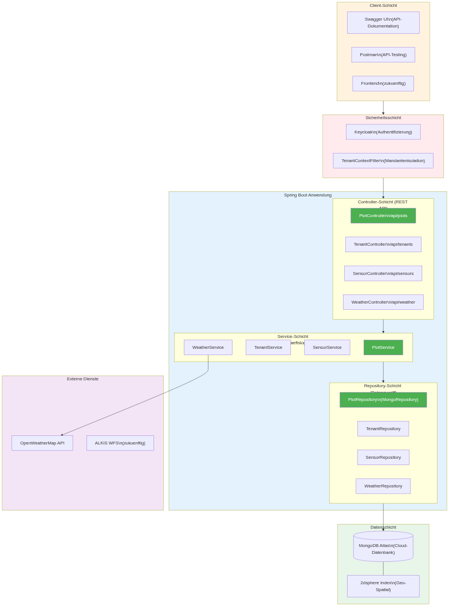
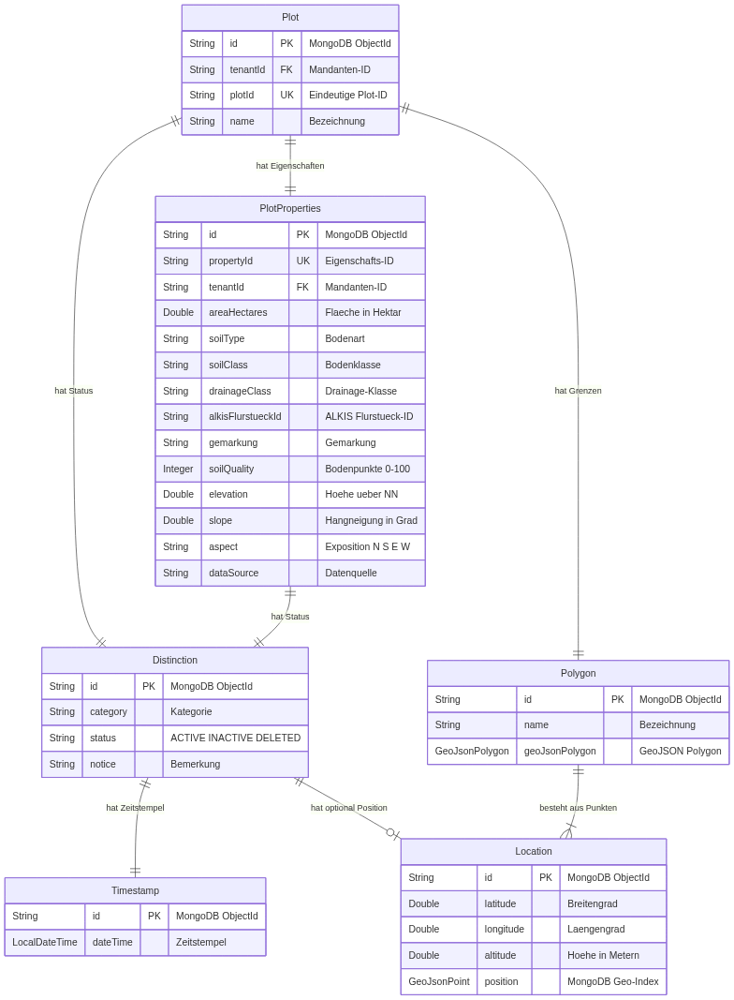
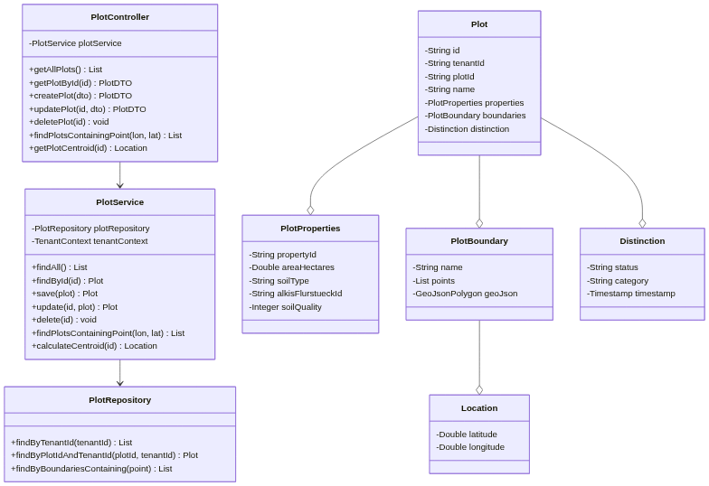
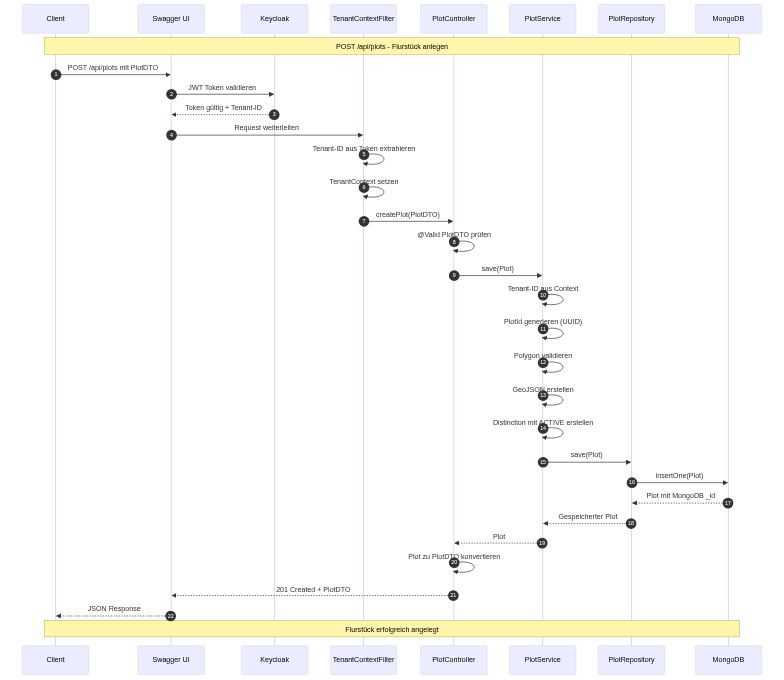

# AckerRadar – Case Study

**A Multi-Tenant REST API for Precision Agriculture with Geo-Spatial Indexing, Multi-Source Data Aggregation, and ALKIS Integration**

---

## At a Glance

| | |
|---|---|
| **Role** | Backend Developer (vocational retraining as IT Specialist for Application Development) |
| **Company** | AckerRadar UG (Berlin-based AgriTech startup) |
| **Scope** | IHK final project, part of a multi-month engagement |
| **Stack** | Java 17, Spring Boot 3.2, MongoDB (with Geo-Spatial Indexing), Maven, JWT, OpenAPI 3 |
| **Domain** | Precision agriculture, geo-spatial data, sensor integration, market data aggregation |
| **Status** | IHK certification passed; codebase is proprietary (NDA) |

---

## The Problem

Agricultural businesses in Germany work with fragmented data sources: weather data comes from one system, commodity prices from another, soil sensors from a third, and official cadastral land records (ALKIS) from a fourth. The consequence: decisions about fertilization, planting, and optimal selling time are based on manually aggregated data, often delayed by hours or days.

AckerRadar set out to unify these data sources in a single system — **multi-tenant** (multiple farms sharing one platform), **near-real-time**, and accessible via **standardized REST APIs** for frontend clients (e.g., QGIS-based map applications).

My task: design and implement the backend API that performs this aggregation — with a particular focus on plot (land parcel) management, sensor data integration, and geo-spatial queries.

---

## Requirements

The non-functional requirements were strict from the start:

- **Multi-tenant isolation** — one farm's data must never be visible to another, not even through faulty queries.
- **Geo-spatial queries** — "Which sensors are inside this plot?", "Which weather station is closest to my sensor?" must be answered performantly.
- **External API integration** — OpenWeatherMap (weather), MATIF/Euronext (grain prices), ALKIS (official cadastral data). Each source has its own quirks: rate limits, format inconsistencies, occasional outages.
- **API-first design** — complete OpenAPI 3 documentation so frontend teams can develop in parallel.
- **JWT-based authentication** with tenant context propagation through all layers.

---

## Architecture

### System Overview

The system follows a classic layered architecture with clear separation between external data sources, the aggregation API, and consuming clients.

### Service Structure

Within the API, a coordinating `DataSyncService` orchestrates the domain services:

- `WeatherService` — connects to OpenWeatherMap, maps sensors to their nearest weather stations
- `MarketDataService` — aggregates commodity data from multiple exchange sources
- `BlogScraperService` — web scraping for regional grain exchanges whose APIs are not publicly available
- `AuthenticationService` — JWT generation and validation

### Data Model

The most interesting architectural element is the **atomic data structure**: three reusable base components (`Distinction`, `Timestamp`, `Location`) used across all domain entities instead of duplicating status/time/location fields.

### Plot Management

Sensors are assigned to plots via GPS point-in-polygon matching — not manual linking.

---

## Technical Decisions and Trade-offs

**MongoDB over PostgreSQL/PostGIS** — Native 2dsphere indexes, schema flexibility for evolving sensor models (2 → 20+ types), natural document fit. Trade-off: limited multi-document ACID.

**Spring Boot over Javalin** — Ecosystem (Spring Security, Spring Data MongoDB, springdoc-openapi) saved weeks. Trade-off: higher memory footprint.

**Hybrid references** — DBRef for structural relationships, denormalized string IDs for tenant filtering.

**Multi-tenancy** — Three layers: denormalized `tenantId` in every document, ThreadLocal `TenantContext` from JWT, compound indexes with `tenantId` leading.

---

## Challenges and Solutions

**GeoJSON Coordinate Order** — `[lon, lat]` vs `[lat, lon]` caused sensors to appear in the North Sea. Solved with a central `CoordinateConverter`.

**Spring Boot 3 Migration** — `javax.*` → `jakarta.*` broke dependencies mid-project. Solved via targeted upgrades and adapter layer.

**MockMvc + Tenant Context** — Documented transparently in IHK submission rather than hidden. Received positively in oral exam.

---

## Sequence Diagram: Creating a Plot

---

## Results

- ~40 REST endpoints, documented via OpenAPI 3
- Multi-tenant isolation at DB, service, and controller levels
- Geo-spatial queries for sensor-to-plot assignment and nearest weather station
- External integrations: OpenWeatherMap, ALKIS (functional); MATIF (stub)
- **IHK certification exam passed**

---

## Lessons Learned

- Atomic data structures pay off when audit requirements are non-negotiable
- MongoDB excels at geo-data and evolving schemas, but isn't a drop-in SQL replacement
- Honest documentation beats polished documentation in technical evaluations
- Multi-tenancy must be designed in from day one

---

## About Me

Yves Kühn, Berlin. Career changer via IHK vocational retraining (passed 2026). Focus: Java backend, MongoDB, REST API design, AI integration. Open-source maintainer of **Orbis**.
